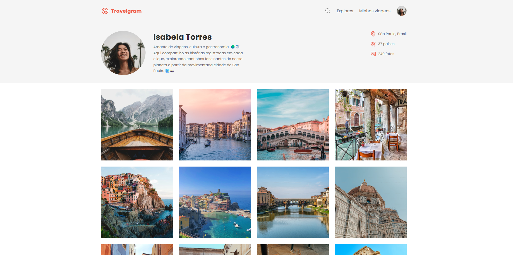

# TRAVELGRAM 🌍✈️

Uma página web que simula uma rede social de viagens, criada para fins educacionais.

## 📋 Sobre o Projeto

O TRAVELGRAM é um projeto desenvolvido durante uma aula prática, apresentando o perfil fictício de Isabela Torres, uma amante de viagens que compartilha suas experiências ao redor do mundo.

## 🚀 Tecnologias Utilizadas

- **HTML5** - Estrutura da página
- **CSS3** - Estilização e layout responsivo
- **Google Fonts** - Tipografia (Poppins)

## 🎨 Funcionalidades

- Layout responsivo
- Galeria de fotos de viagens
- Perfil de usuário com informações
- Navegação intuitiva

## ⚠️ Aviso

Todas as informações apresentadas são fictícias e criadas apenas para fins educacionais.

---
*Projeto desenvolvido para aprendizado de HTML e CSS*
